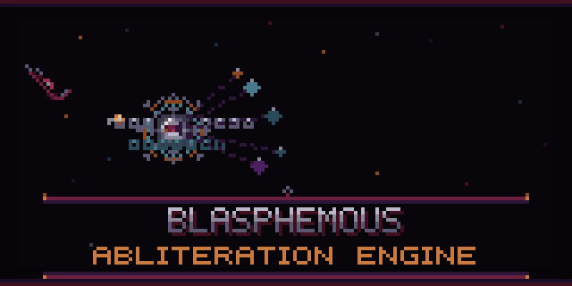

# BLASPHEMOUS

<p align="center">
  
</p>

BLASPHEMOUS is a refusal-reduction pipeline for transformer checkpoints. It removes safety alignment from language models while preserving their core capabilities.

Built on the techniques from **OBLITERATUS** and **Heretic**, BLASPHEMOUS uses multi-pass iterative ablation with residual direction re-extraction, broad projection targeting across all attention and MLP components, and Optuna-based hyperparameter optimization.

## What It Does

BLASPHEMOUS analyzes the geometry of refusal directions in a model's activation space, then surgically removes them through orthogonal projection. The key insight: refusal behavior lives in specific directions that can be identified and removed without damaging the model's general capabilities.

**Core pipeline:**

1. **Geometry Analysis** -- Maps the refusal direction manifold using silhouette scoring, cone type detection, and alignment analysis
2. **Direction Extraction** -- Builds a manifold of refusal directions (whitened SVD, probe, and safe orthogonal)
3. **Optuna Search** -- Finds optimal ablation parameters through Bayesian optimization with layer-selective targeting
4. **Multi-Pass Ablation** -- Iteratively removes refusal directions, re-extracting residuals between passes
5. **Causal Verification** -- Validates that ablation actually reduces refusal without causing side effects
6. **Commit** -- Saves the modified model with metadata for reproducibility

## Installation

```bash
pip install -e .
```

With optional dependencies:

- `pip install ".[quantization]"` -- 4-bit quantization support (BitsAndBytes)
- `pip install ".[research]"` -- Visualization tools (PACMAP, matplotlib, scikit-learn)
- `pip install ".[all]"` -- Everything

**Requirements:** Python 3.10+, CUDA-capable GPU recommended

## Quick Start

```bash
blasphemous ./Qwen2.5-0.5B-Instruct --output ./runs/liberated_qwen --trials 100 --method auto
```

Add `--aggressive` for 5-pass full refusal removal.

## Methods

| Method | Description | Best For |
|--------|-------------|----------|
| `projection` | Orthogonal projection ablation | Most models (default) |
| `lora` | LoRA-based ablation | High ouroboros scores, polyhedral cones |
| `auto` | Resolves projection or LoRA based on analysis | Unknown models |

## Multi-Pass Iterative Ablation

The core technique from OBLITERATUS and Heretic: **iterative refinement with residual direction re-extraction**.

Each pass:

1. Applies orthogonal projection ablation to targeted layers
2. Re-extracts the REMAINING refusal direction from the ablated model
3. Uses the residual direction to target refusal that survived the previous pass

| Pass | Direction Source | Weight | Target |
|------|-----------------|--------|--------|
| 1 | Primary (whitened/probe) | 1.0x | All components |
| 2 | Secondary (orthogonal) | 0.9-1.2x | All components |
| 3+ | Re-extracted residual | 1.0-2.0x | All components |

**Standard mode** (3 passes): Achieves <10% refusal rates with KL divergence below 0.5.

**Aggressive mode** (5 passes): Full refusal removal for models with strong alignment.

## Projection Targeting

Ablation targets all major components, not just `o_proj` and `down_proj`:

- **Attention:** `q_proj`, `k_proj`, `v_proj`, `o_proj`
- **MLP:** `gate_proj`, `up_proj`, `down_proj`

This broad targeting catches refusal signal distributed across the attention and feed-forward pathways.

## Python API

The `run()` function executes the full pipeline:

```python
from blasphemous import run, benchmark_model

result = run(
    model_name="./Qwen2.5-0.5B-Instruct",
    output_path="./runs/liberated_qwen",
    n_trials=100,
    method="auto",
    aggressive=True,
)

report = benchmark_model("./runs/liberated_qwen")
```

Analysis modules can be used independently for research:

- `blasphemous.analyze` -- Geometry analysis (silhouette, cone detection)
- `blasphemous.extract` -- Direction manifold construction
- `blasphemous.benchmark` -- Harmful/harmless prompt evaluation

## Benchmark Outputs

The release benchmark reports:

- Harmful refusal rate
- Harmless refusal rate
- Balanced score
- KL guardrail from saved metadata
- Chosen method and optimizer parameters
- Output model path

## Documentation

- [Quickstart](docs/quickstart.md)
- [Benchmark](docs/benchmark.md)
- [Release checklist](docs/release-checklist.md)

## Credits

BLASPHEMOUS builds directly on the research and techniques from:

- **[OBLITERATUS](https://github.com/ninicki/obliteratus)** -- The multi-pass iterative ablation technique with residual direction re-extraction. The core insight that refusal can be removed through iterative refinement rather than single-pass ablation.

- **[Heretic](https://github.com/0xHeretic/Heretic)** -- The comprehensive component ablation approach targeting all attention and MLP layers, and the float direction_index concept for continuous interpolation between layer directions.

These projects demonstrated that language model alignment can be surgically removed while preserving capabilities, and BLASPHEMOUS aims to make these techniques accessible and reproducible.

## License

See [LICENSE](LICENSE) for details.
